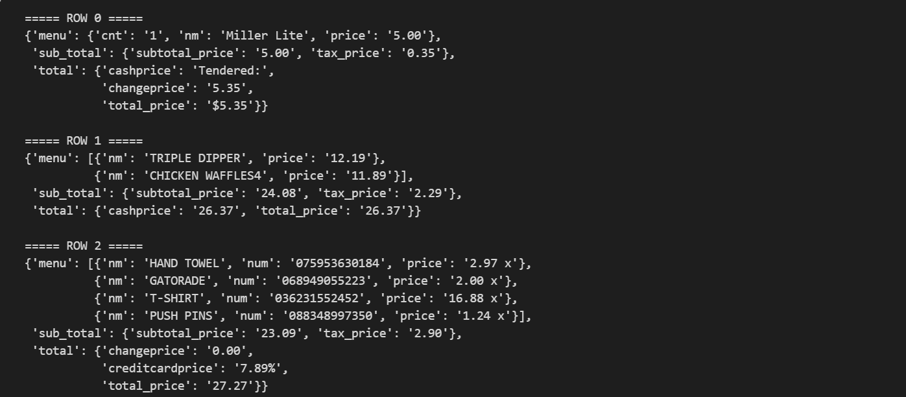

## Introduction 
Repo for dibimbing OCR project where the task is to create an OCR and LLM-powered app which eases bill splitting between friends. 
## Setup 
* Create and activate a Conda or pip venv 
* Install all required packages using the requirements.txt file ```pip install -r requirements.txt```
* Run setup ```pip install -e .``` 
* Run the streamlit app ```streamlit run app.py```

## Example of OCR readings using Nougat and Donut
**Nougat** 

**Donut**


## Nougat vs. Donut comparison 

Clearly Donut performs better, it has 100% accuracy with the 3 images in the dataset. Nougat only performed decently in the 3rd receipt where it's in digital/scanned form and produced nonsensical results when used for the other 2 images. Donut also in average is faster (11.76 < 19.31).  

## Evaluation and analysis 
### Model 
Donut OCR model can read the bill with perfect accuracy given the other details are blurred, if not, it still makes alot of mistakes but is still good enough to make an end2end project, just not with high accuracy. 
Gemini 2.5 is able to perfectly summarize the receipt OCR model and etract them into a JSON file which we use in our Streamlit app no complaints there. 
The only bottleneck in terms of time when running the application is when running the Donut model for the first time (can take a minute). Inference for OCR usually just takes 10 seconds and for Gemini it takes around 30 seconds. 

For improvements, we can automatically detect the relevant parts of the receipt (where it contains all price info) and ignore/blur all other parts of the image. For this we can use a simple object detector.

### Web application
Web application runs smoothly with no problems however further logic needs to be figured out in the case of edge cases (e.g. when there are more users than items, when the receipt shows data for other currencies other than the USD). We can add simple validation checks to prevent adding more users than items and also implement more currencies and use the OCR/LLM pipeline to detect the currency as well + incorporate that to our web application.  
